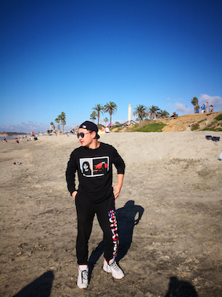

Photo credit: [Chao Zhang](http://chaozhang.org/)

## Contact
Email: xchen[AT]cs.ucla.edu    
Office: 3551 Boelter Hall, 420 Westwood Plaza, Los Angeles, California 90095    

<!-- ## What's New
2018-09-10 Start my Ph.D. journey @ UCLA!

2018-08-17 One paper got accepted by ICDM'18.

2018-05-06 One paper got accepted by KDD'18.

2018-11-09 One paper got accepted by AAAI'18.

2017-10-01 Submitted one paper to ICDE'18.

2017-09-12 Submitted two papers to AAAI'18.

2017-04-12 Our paper on Index of distributed graph data processing systems was accepted by [NDBC 2017](http://www.cs.zju.edu.cn/ndbc2017/)! See you in Hangzhou this Autumn!

2017-06-30 Visiting Prof. [ChengXiang Zhai](http://czhai.cs.illinois.edu/)'s [TIMAN](http://sifaka.cs.uiuc.edu/ir/index.html) Group at CS@UIUC for 6 months.

2017-05-23 Submitted one paper to CIKM'17.

2016-09-26 Start my internship as a research intern at [Alibaba Group](http://www.alibabagroup.com/en/global/home)

2016-04-12 Our paper on Semi-supervised advertisement detection was accepted by [NDBC 2016](http://csse.szu.edu.cn/ndbc2016/index.shtml)! See you in Shenzhen this Autumn!

2015-07-06 I graduated from [Peking University](http://www.pku.edu.cn/) where I spent 4 wonderful years and made lots of great friends. I am grateful to Prof. [Jun Gao]() for his support throughout the years. [My thesis](papers/thesis.pdf)

2014-10-26 I am honor to compete on behalf of Peking University at the 17th Chinese University Basketball Association (CUBA) Championships, Beijing Division. We are the 3rd Place!
 -->

## Bio
I received my Ph.D. degree in [Computer Science](https://www.cs.ucla.edu/) from [University of California, Los Angeles](http://www.ucla.edu/), where I had the fortune to be advised by Prof. [Wei Wang](http://web.cs.ucla.edu/~weiwang/). My research interests are **Natural Language Processing**, **Complex Dynamics Modeling and Decision-Making**, and **Multi-Modality**.

Before UCLA, I got my M.S. and B.S. from [Department of Computer Science](https://cs.pku.edu.cn/) at [Peking University](https://english.pku.edu.cn/). During my M.S. years, I was under the supervision of Prof. [Jun Gao](https://cs.pku.edu.cn/info/1214/1977.htm). I also worked at [University of Illinois, Urbana-Champaign](http://www.cs.uiuc.edu/) and worked on several interesting topics in text mining, with Prof. [ChengXiang Zhai](http://czhai.cs.illinois.edu/).

I played for Peking University Men's Basketball Varsity Team, Division II, during college.

I was born and raised in Changsha, Hunan, China.

For further information, please see my [CV](CV.pdf).

## Preprint   
[A Comprehensive Survey of Scientific Large Language Models and Their Applications in Scientific Discovery](https://arxiv.org/pdf/2406.10833)    
Yu Zhang\*, **Xiusi Chen**\*, Bowen Jin\*, Sheng Wang, Shuiwang Ji, Wei Wang, Jiawei Han    
\[[project page](https://github.com/yuzhimanhua/Awesome-Scientific-Language-Models)\]    
400+ stars as of 8/2024

[TinyLLM: Learning a Small Student from Multiple Large Language Models](https://arxiv.org/pdf/2402.04616.pdf)    
Yijun Tian\*, Yikun Han\*, **Xiusi Chen**\*, Wei Wang, Nitech V. Chawla    
\[[code](https://github.com/YikunHan42/TinyLLM)\]

[Chain-of-Factors Paper-Reviewer Matching](https://arxiv.org/pdf/2310.14483)    
Yu Zhang, Yanzhen Shen, SeongKu Kang, **Xiusi Chen**, Bowen Jin, Jiawei Han    
\[[code]()\]

[Bridging Language and Items for Retrieval and Recommendation](https://arxiv.org/pdf/2403.03952) (**Amazon Reviews 2023**)    
Yupeng Hou\*, Jiacheng Li\*, Zhankui He, An Yan, **Xiusi Chen**, Julian McAuley    
\[[code](https://github.com/hyp1231/AmazonReviews2023)\]\[[website](https://amazon-reviews-2023.github.io/)\]\[[huggingface](https://huggingface.co/datasets/McAuley-Lab/Amazon-Reviews-2023)\]    
200k+ downloads as of 5/2024

[Large Scale Knowledge Washing](https://arxiv.org/pdf/2405.16720)    
Yu Wang, Ruihan Wu, Zexue He, **Xiusi Chen**, Julian McAuley    
\[[code]()\]    

[Strategist: Learning Strategic Skills by LLMs via Bi-Level Tree Search](https://openreview.net/pdf?id=UHWBmZuJPF)    
Jonathan Light, Min Cai, Weiqin Chen, Guanzhi Wang, **Xiusi Chen**, Wei Cheng, Yisong Yue, Ziniu Hu    
\[[code]()\]    

<!--[_Learning Item Embedding with Heterogeneous Information for Collaborative Filtering_](papers/icde18.pdf)    
**Xiusi Chen**, Xiaoyu Li, Chang Zhou, Xiaofei Liu, Jun Gao    
-->

## Publication
[MinPrompt: Graph-based Minimal Prompt Data Augmentation for Few-shot Question Answering](https://arxiv.org/pdf/2310.05007.pdf)    
**Xiusi Chen**, Jyun-Yu Jiang, Wei-Cheng Chang, Cho-Jui Hsieh, Hsiang-Fu Yu and Wei Wang     
_ACL 2024_     
\[[code](https://github.com/xiusic/MinPrompt)\]

[IterAlign: Iterative Constitutional Alignment of Large Language Models](https://arxiv.org/pdf/2403.18341.pdf)    
**Xiusi Chen**, Hongzhi Wen, Sreyashi Nag, Chen Luo, Qingyu Yin, Ruirui Li, Zheng Li, Wei Wang    
_NAACL 2024_     
\[[code](https://github.com/xiusic/IterAlign)\]

[PlayBest: Professional Basketball Player Behavior Synthesis via Planning with Diffusion](https://arxiv.org/pdf/2306.04090.pdf)    
**Xiusi Chen**\*, Wei-Yao Wang\*, Ziniu Hu, David Reynoso, Kun Jin, Mingyan Liu, P. Jeffrey Brantingham, Wei Wang     
_CIKM 2024_    
\[[code](https://github.com/xiusic/diffuser_bball)\]

[Gotta: Generative Few-shot Question Answering by Prompt-based Cloze Data Augmentation](https://epubs.siam.org/doi/epdf/10.1137/1.9781611977653.ch102)    
**Xiusi Chen**, Yu Zhang, Jinliang Deng, Jyun-Yu Jiang and Wei Wang  
_SDM 2023_     
\[[code](https://github.com/xiusic/Gotta)\]     
Best Poster Award (Honorable Mention)

[Scalable Graph Representation Learning via Locality-Sensitive Hashing](papers/cikm_b.pdf)   
**Xiusi Chen**, Jyun-Yu Jiang and Wei Wang    
_CIKM 2022_

[ReLiable: Offline Reinforcement Learning for Tactical Strategies in Professional Basketball Games](papers/cikm_a.pdf)       
**Xiusi Chen**, Jyun-Yu Jiang, Kun Jin, Yichao Zhou, Mingyan Liu, Jefferey Brantingham and Wei Wang    
_CIKM 2022_

[MemoryLLM: Toward Self-Updating Large Language Models](https://arxiv.org/pdf/2402.04624)    
Yu Wang, Yifan Gao, **Xiusi Chen**, Haoming Jiang, Shiyang Li, Jingfeng Yang, Qingyu Yin, Zheng Li, Xian Li, Bing Yin, Jingbo Shang, Julian McAuley    
_ICML 2024_    
\[[code](https://github.com/wangyu-ustc/MemoryLLM)\]

[Language Models as Semantic Indexers](https://arxiv.org/pdf/2310.07815)    
Bowen Jin, Hansi Zeng, Guoyin Wang, **Xiusi Chen**, Tianxin Wei, Ruirui Li, Zhengyang Wang, Zheng Li, Yang Li, Hanqing Lu, Suhang Wang, Jiawei Han, Xianfeng Tang    
_ICML 2024_    
\[[code](https://github.com/PeterGriffinJin/LMIndexer)\]

[TPD: Enhancing Student Language Model Reasoning via Principle Discovery and Guidance](https://arxiv.org/pdf/2401.13849)    
Haorui Wang, Rongzhi Zhang, Yinghao Li, Lingkai Kong, Yuchen Zhuang, **Xiusi Chen**, Chao Zhang    
_COLM 2024_    

[Disentangling Structured Components: Towards Adaptive, Interpretable and Scalable Time Series Forecasting](https://ieeexplore.ieee.org/abstract/document/10457027)    
Jinliang Deng, **Xiusi Chen**, Renhe Jiang, Du Yin, Yi Yang, Xuan Song, Ivor W. Tsang    
_TKDE 2024_    
\[[code](https://github.com/JLDeng/SCNN)\]

[How the Experience of California Wildfires Shapes Twitter Climate Change Framings](https://link.springer.com/article/10.1007/s10584-023-03668-0)    
Jessie W. Y. Ko, Shengquan Ni, Alexander Taylor, **Xiusi Chen**, Yicong Huang, Avinash Kumar, Sadeem Alsudais, Zuozhi Wang, Xiaozhen Liu, Wei Wang, Chen Li, Suellen Hopfer    
_Climatic Change, 2024_

[Data Science Tasks Using Scripts versus GUI-based Workflows: The Good, the Bad, and the Ugly]()    
Alexander Taylor, Yicong Huang, Junheng Hao, Xinyuan Lin, **Xiusi Chen**, Wei Wang, Chen Li    
_DataPlat@ICDE 2024_

[Weakly Supervised Multi-Label Classification of Full-Text Scientific Papers](https://arxiv.org/pdf/2306.14003.pdf)       
Yu Zhang, Bowen Jin, **Xiusi Chen**, Yanzhen Shen, Yunyi Zhang, Yu Meng, and Jiawei Han    
_KDD 2023_    
\[[code](https://github.com/yuzhimanhua/FUTEX)\]

[A Multi-view Multi-task Learning Framework for Multi-variate Time Series Forecasting](https://arxiv.org/pdf/2109.01657.pdf)    
Jinliang Deng, **Xiusi Chen**, Renhe Jiang, Xuan Song and Ivor W. Tsang   
_TKDE 2022_

[MotifClass: Weakly Supervised Text Classification with Higher-order Metadata Information](https://arxiv.org/pdf/2111.04022.pdf)    
Yu Zhang\*, Shweta Garg\*, Yu Meng, **Xiusi Chen** and Jiawei Han    
_WSDM 2022_    
\[[code](https://github.com/yuzhimanhua/MotifClass)\]

[COVID-19 Surveiller: Toward a Robust and Effective Pandemic Surveillance System based on Social Media Mining](https://royalsocietypublishing.org/doi/epdf/10.1098/rsta.2021.0125)    
Jyun-Yu Jiang, Yichao Zhou, **Xiusi Chen**, Yan-Ru Jhou, Liqi Zhao, Sabrina Liu, Po-Chun Yang, Jule Ahmar, Wei Wang    
_Philosophical Transactions A, 2022_

[\#StayHome or \#Marathon? Social Media Enhanced Pandemic Surveillance on Spatial-temporal Dynamic Graphs](https://dl.acm.org/doi/pdf/10.1145/3459637.3482222)    
Yichao Zhou, Jyun-Yu Jiang, **Xiusi Chen** and Wei Wang    
_CIKM 2021_    
\[[code](https://github.com/joey1993/pandemic-forecast)\]

[ST-Norm: Spatial and Temporal Normalization for Multi-variate Time Series Forecasting](https://dl.acm.org/doi/10.1145/3447548.3467330)    
Jinliang Deng, **Xiusi Chen**, Renhe Jiang, Xuan Song, and Ivor W. Tsang    
_KDD 2021_    
\[[code](https://github.com/JLDeng/ST-Norm)\]

[Evaluating audience loyalty and authenticity in influencer marketing via multi-task multi-relational learning](https://ojs.aaai.org/index.php/ICWSM/article/view/18060/17863)    
Seungbae Kim, **Xiusi Chen**, Jyun-Yu Jiang, Jinyoung Han, and Wei Wang    
_ICWSM 2021_

[The Pulse of Urban Transport: Exploring the Co-evolving Pattern for Spatio-temporal Forecasting](https://dl.acm.org/doi/10.1145/3450528)    
Jinliang Deng, **Xiusi Chen**, Zipei Fan, Renhe Jiang, Xuan Song, and Ivor W. Tsang    
_TKDD 2021_

[Hierarchical Metadata-Aware Document Categorization under Weak Supervision](https://arxiv.org/pdf/2010.13556)    
Yu Zhang, **Xiusi Chen**, Yu Meng, Jiawei Han    
_WSDM 2021_    
\[[code](https://github.com/yuzhimanhua/HIMECat)\]

[Self-Attentive Few-Shot Learning for New User Recommendation in Location-based Social Networks](https://dl.acm.org/doi/pdf/10.1145/3366423.3379994)    
Ruirui Li, Xian Wu, **Xiusi Chen**, Wei Wang    
_WWW 2020_

[Doc2Cube: Allocating Documents to Text Cube without Labeled Data](http://chaozhang.org/papers/icdm18.pdf)    
Fangbo Tao\*, Chao Zhang\*, **Xiusi Chen**, Meng Jiang, Tim Hanratty, Lance Kaplan, Jiawei Han    
_ICDM 2018_    
\[[code](https://github.com/fangbo-tao/doc2cube)\]

[TaxoGen: Unsupervised Topic Taxonomy Construction by Adaptive Term Embedding and Clustering](http://delivery.acm.org/10.1145/3230000/3220064/p2701-zhang.pdf?ip=131.179.49.186&id=3220064&acc=ACTIVE%20SERVICE&key=CA367851C7E3CE77%2E79535EF926D6BC05%2E4D4702B0C3E38B35%2E4D4702B0C3E38B35&__acm__=1543628672_ac235d30fba1750ceaae158e46248e19)    
Chao Zhang, Fangbo Tao, **Xiusi Chen**, Jiaming Shen, Meng Jiang, Brian Sadler, Michelle Vanni, Jiawei Han     
_KDD 2018_    
\[[code](https://github.com/franticnerd/taxogen)\]

[ATRank: An Attention-Based User Behavior Modeling Framework for Recommendation](papers/aaai18_zhou.pdf)    
Chang Zhou, Jinze Bai, Junshuai Song, Xiaofei Liu, Zhengchao Zhao, **Xiusi Chen**, Jun Gao    
_AAAI 2018_    
\[[code](https://github.com/jinze1994/ATRank)\]

## Patent
[_Knowledge graph and alignment with uncertainty embedding_](https://patentimages.storage.googleapis.com/bb/ae/b3/bdfd4a1c6a8528/US20210103706A1.pdf)    
Wenchao Yu, Bo Zong, Wei Cheng, Haifeng Chen, **Xiusi Chen**    
_US Patent App. 17/060,850_

## Academic Service
**Conference Program Committee**        
_KDD 2020-2025; WSDM 2022-2025; WWW 2024; SSL@WWW 2021_;    
_ICML 2023-2024; NeurIPS 2022-2024; ICLR 2022-2024; AAAI 2021-2024; IJCAI-ECAI 2022-2023_;    
_ACL Rolling Review_    

**Conference Subreviewer**    
_KDD 2018, CIKM 2018, WISE 2018, IJCAI 2019_

**Journal Reviewer**    
_IEEE Transactions on Big Data (TBD)_.

## Honors and Awards
**2023**  Best Poster Award (Honorable Mention), _SDM 2023_   
**2023**  SIAM Student Travel Award, _SIAM_   
**2021, 2022**  SIGIR Student Travel Grant, _ACM SIGIR_    
**2016, 2017**  Graduate Student Acedemic Scholarship, _Peking University_     
**2016**  Leo KoGuan Scholarshop, _Peking University_    
**2016**  Merit Student, _Peking University_     
**2014**  3rd Place of 17th Chinese University Basketball Association (CUBA) Championships, Beijing Division, _Federation of University Sports of China_   

## Miscellaneous

*   I played for Peking University Men's Basketball varsity team, division II.
*   I was a registered swimming athlete in China during high school.

## Links
[❤️](https://sites.google.com/site/ruihanwu14/)    
[Google Scholar](https://scholar.google.com/citations?user=JqGAil4AAAAJ)    
[DBLP](https://dblp.org/pid/210/1049)    
[Facebook](https://www.facebook.com/xiusi.chen)    
[Twitter](https://twitter.com/XtremSup)    

